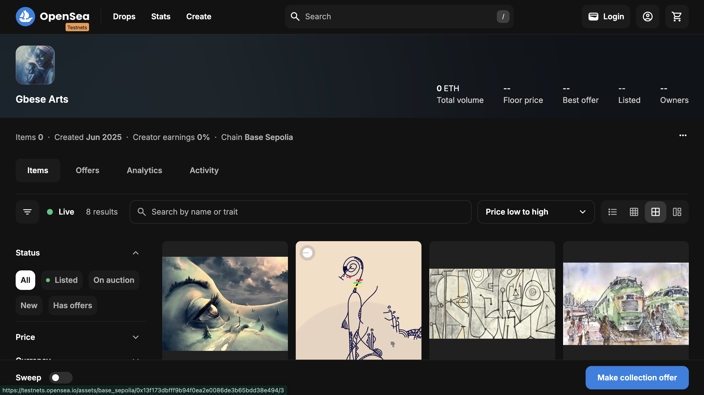
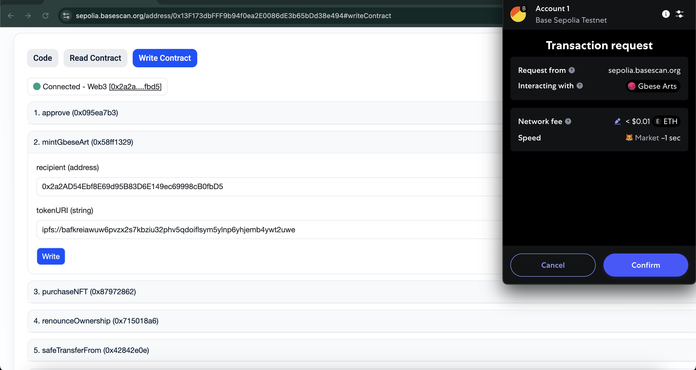

# GbeseArts NFT Contract

An ERC-721 NFT contract for the Gbese web app that integrates with the Gbese ERC-20 token for on-chain purchases.

---

## Overview

**GbeseArts** is an ownable ERC-721 contract with:

- **Admin minting** via `mintGbeseArt(recipient, tokenURI)`  
- **Token-gated purchase** via `purchaseNFT(tokenURI)`, priced in Gbese (GBT) tokens  
- **Configurable** Gbese token address, base metadata URI, and purchase price  

---

## Contract Details

```solidity
// SPDX-License-Identifier: UNLICENSED
pragma solidity ^0.8.28;

import "@openzeppelin/contracts/token/ERC721/extensions/ERC721URIStorage.sol";
import "@openzeppelin/contracts/token/ERC20/IERC20.sol";
import "@openzeppelin/contracts/access/Ownable.sol";

contract GbeseArts is ERC721URIStorage, Ownable {
    uint256 private _currentTokenId;
    address public gbeseTokenAddress;
    uint256 public nftPriceInTokens = 100 * 10**18; 
    string private _baseTokenURI;

    event NFTMinted(address indexed recipient, uint256 tokenId, string tokenURI);
    event NFTPurchased(address indexed buyer, uint256 tokenId);
    event PriceUpdated(uint256 oldPrice, uint256 newPrice);

    constructor() ERC721("Gbese Arts", "GBA") Ownable(msg.sender) {
        _currentTokenId = 0;
    }

    function _getNextTokenId() private returns (uint256) {
        return ++_currentTokenId;
    }

    function setTokenContract(address tokenAddress) external onlyOwner {
        require(tokenAddress != address(0), "Invalid token address");
        gbeseTokenAddress = tokenAddress;
    }

    function setBaseURI(string memory baseURI) external onlyOwner {
        _baseTokenURI = baseURI;
    }

    function _baseURI() internal view override returns (string memory) {
        return _baseTokenURI;
    }

    function mintGbeseArt(address recipient, string calldata tokenURI)
        external onlyOwner returns (uint256)
    {
        uint256 newItemId = _getNextTokenId();
        _mint(recipient, newItemId);
        _setTokenURI(newItemId, tokenURI);
        emit NFTMinted(recipient, newItemId, tokenURI);
        return newItemId;
    }

    function purchaseNFT(string calldata tokenURI)
        external returns (uint256)
    {
        require(gbeseTokenAddress != address(0), "Token contract not set");
        IERC20 gbeseToken = IERC20(gbeseTokenAddress);

        require(
            gbeseToken.balanceOf(msg.sender) >= nftPriceInTokens,
            "Insufficient token balance"
        );

        bool success = gbeseToken.transferFrom(
            msg.sender, address(this), nftPriceInTokens
        );
        require(success, "Token transfer failed");

        uint256 newItemId = _getNextTokenId();
        _mint(msg.sender, newItemId);
        _setTokenURI(newItemId, tokenURI);
        emit NFTPurchased(msg.sender, newItemId);
        return newItemId;
    }
}
```

---

## Usage

### 1. Configure Gbese Token

```solidity
await gbeseArts.setTokenContract(<GbeseTokenAddress>);
```

### 2. Set Base URI

```solidity
await gbeseArts.setBaseURI("ipfs://<your-base-cid>/");
```

### 3. Admin Mint

```solidity
await gbeseArts.mintGbeseArt(recipientAddress, "ipfs://<metadata-cid>");
```

### 4. Purchase with GBT

**Approve GBT Spending**

```solidity
await gbeseToken.approve(gbeseArts.address, priceInWei);
```

**Purchase the NFT**

```solidity
await gbeseArts.purchaseNFT("ipfs://<metadata-cid>");
```

---

## 📦 Deliverables

* **Sourcify Full-Match**
  [https://repo.sourcify.dev/contracts/full\_match/84532/0xc597FaaaaF61862f6ddb1015f3B209a51efac85F/](https://repo.sourcify.dev/contracts/full_match/84532/0xc597FaaaaF61862f6ddb1015f3B209a51efac85F/)

* **BaseScan Verified Contract**
  [https://sepolia.basescan.org/address/0xc597FaaaaF61862f6ddb1015f3B209a51efac85F#code](https://sepolia.basescan.org/address/0xc597FaaaaF61862f6ddb1015f3B209a51efac85F#code)

* **Contract Address**
  `0xc597FaaaaF61862f6ddb1015f3B209a51efac85F`

* **OpenSea Testnet Collection**
  [https://testnets.opensea.io/collection/gbese-arts-11](https://testnets.opensea.io/collection/gbese-arts-11)

---

## ⚙️ Configuration Notes

* **Solidity Version:** `^0.8.28`
* **ERC Standard:** `ERC721URIStorage`
* **Ownership:** `Ownable` from OpenZeppelin
* **Token-Based Pricing:** Set in `nftPriceInTokens`
* **Compatible Token:** ERC-20 with 18 decimals (e.g. GBT)

---

## 🖼️ Screenshots

### NFT Collection on OpenSea (Base Sepolia)



### Minting NFT via BaseScan


